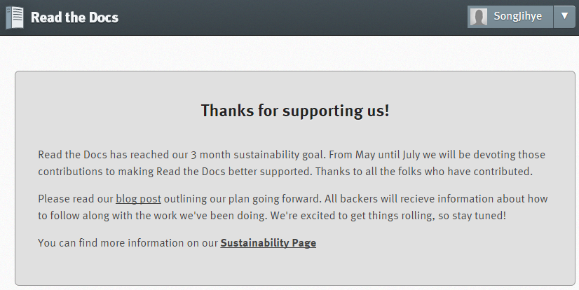

RTD(Read the docs) 사용 방법
-----

1. RTD 
=====
.. note::
Read the docs는 Open source community를 호스팅 하기 위한 문서다.
Mkdocs를 위한 Markdown 문서와 reStructured Text를 작성하기 위한 Sphinx를 지원한다. 
Subversion, Bazaar, Git, Mercurial 과 같은 repository 를 통해 문서 등록이 가능하다. 
문서를 build 하고, build 된 문서를 호스팅 할 수 있다. 

2. GIT Repository 업로드
=====

1) Read the docs Service 접속
~~~~~

- http://10.21.6.58:8000 

2) 가입 및 로그인
~~~~~

3) Project 메뉴 선택
~~~~~

- 신규 Project를 추가할 경우 Add Project 선택 함.

4) Project(Manual) 선택
~~~~~

- 신규 Project의 경우 Import Project 버튼을 클릭하여 Project 생성 함.
- 기존 Project의 경우 Project 목록 확인하여 클릭 함.

.. image:: image/Readthedocs02.png

5) Git Repository 확인
~~~~~

- RTD 서비스의 경우 public 상태만 호스팅 서비스 제공함.
- Commit 된 내역 확인. 

6) Project 확인
~~~~~

- Overview : 전반적인 프로젝트 정보 확인. Badge를 통해 현재 프로젝트 상태 및 버전 확인 가능.
- Downloads : 문서 다운로드
- Search : 문서 찾기
- Builds : Repository의 현재 등록 된 최근 버전으로 Project 빌드 함.
- Version : Active/Inactive 별로 버전 관리 가능. Wipe를 이용하여 빌드가 잘 안될 경우 청소 개념으로 생성된 문서 정리 가능.
- Tools : Embed API 제공. 
- Admin : Project 정보 및 Repository 정보 수정 및 확인
- View Docs : Build 된 Project 웹페이지에서 확인  

7) Build
~~~~~

- Project 에서 Build 클릭 하여 Build Version(latest 등) 확인 후 Build Version 버튼 클릭하여 Project 빌드 함. 
- Triggered : Access Repository 
- Cloning : Repository Copy
- Building : Project build
- Install : Project Install
- Passed : success build
- Failed : failed build (이전 버전으로 project hosting 유지 됨)

3. RTD Service에 메뉴얼 등록
=====

- Name : Project Name. 
- 빌드 된 후 아래 서비스 Home Name 에서 확인 가능 함.
 

- Repository URL
- Git Repository 로 https://~.git 등록 (아래 Repository type 에 git 선택) 

4. RTD Service 빌드
=====

- Admin 에서 Repository 등록 후, Submit 하게 되면 자동 build 동작 함.
- 또는 Build 화면 `2-7) Build` 에서 빌드함.

5. RTD Service 체크
=====

- http://**Project name**.readthedocs.org/en/latest/ 에서 확인 가능 함.
